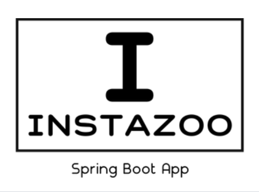

# Instazoo

---
## Описание проекта:
Данное REST приложение написано при помощи **Spring Boot** и **Spring Security** и является клоном Instagram.  
В нем реализована возможность просматривать и создавать посты и комментарии, а также добавлять фотографии к постам 

### Что используется в приложении:
* Валидация полей при регистрации, авторизации, добавлении комментария и поста
* **JWT** - стандарт для создания токенов доступа
* Хэширование паролей по методу **bcrypt**
* REST контроллеры
---

### Требования:
Для запуска проекта необходим [MySQL](https://dev.mysql.com/downloads/installer "Вы можете скачать, перейдя по ссылке")
и [Maven](https://dev.mysql.com/downloads/installer) 
Также для использования приложения необходим сервис [Postman](https://www.postman.com/downloads/)

### Начало работы:
1. В файле ``application.properties`` необходимо установить логин и пароль от БД
   1. В строке ``spring.datasource.username=root`` устанавливаем имя пользователя
   2. В строке ``spring.datasource.password=admin`` устанавливаем пароль
2. В Postman необходимо зарегистрироваться и авторизоваться, после чего полученный **JWT** токен добавлять в ``headers`` в запросе
    1. Зарегистрируйтесь и авторизуйтесь в приложении при помощи запроса ``api/v1/auth/signup`` для регистрации и ``api/v1/auth/signin`` для авторизации
    2. После авторизации необходимо скопировать токен, который находится в **body**
    3. Создайте новый запрос (например, для создания поста)
    4. В строке **headers** запроса необходимо добавить новую строку, где key = **Authorization**, а value - полученный JWT токен
    5. Запрос будет успешно выполнен